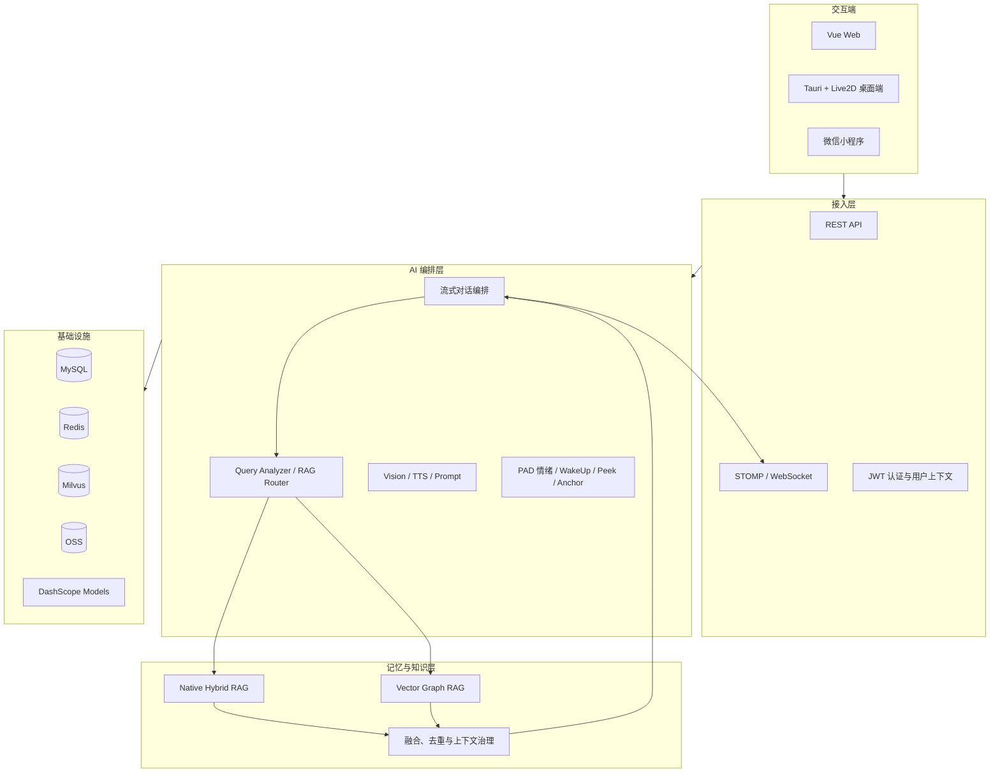
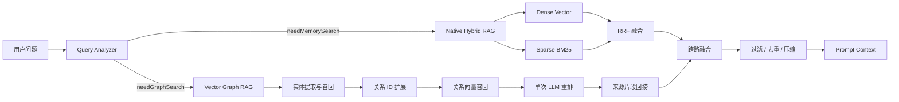

<div align="center">

# Sister Project

### 面向长期陪伴场景的多模态 AI 伴侣系统

让对话不止停留在当前窗口：系统在持续交互中组织记忆、关系、情绪与多模态上下文，并通过 Web 与 Live2D 桌面端提供实时反馈。

[](https://openjdk.org/projects/jdk/21/)
[](https://spring.io/projects/spring-boot)
[](https://github.com/langchain4j/langchain4j)
[](https://vuejs.org/)
[](https://tauri.app/)
[](https://milvus.io/)

</div>

## 项目简介

Sister Project 是一个围绕“长期交互”构建的全栈 AI 伴侣项目。它不仅处理一次问答，还尝试回答更难的系统问题：当对话跨越数周甚至更久，应用如何保留重要经历，关联人物与事件，维持角色状态，并把文本、视觉、语音与主动行为组织进同一条交互链路。

项目以 **Java 21、Spring Boot 3、LangChain4j 与通义千问**为后端核心，使用 **MySQL、Redis、Milvus 与 OSS**承载业务数据、短期状态、长期记忆和文件资源；交互侧同时提供 **Vue Web 客户端**与 **Tauri + Live2D 桌面客户端**。

这里的重点不是堆叠模型能力，而是把它们放进一套边界清晰的应用架构：

- 用路由式 RAG 判断当前问题是否需要历史记忆、关系图谱，或双路检索
- 用 dense vector、sparse BM25 与 RRF 兼顾语义召回和关键词命中
- 用 Vector Graph RAG 关联实体、关系与来源片段，补足普通向量检索对事实链路的表达能力
- 用有界执行器、背压和局部降级隔离 LLM、TTS、Milvus 与图像服务的延迟
- 用 STOMP over WebSocket 统一推送文本、音频、情绪、表情、动作和系统事件

## 系统设计



系统按接入、编排、领域与基础设施划分职责。用户消息进入后，聊天编排层会结合身份、近期消息、长期记忆、关系图谱、情绪状态和多模态信息组装上下文；模型输出则被拆分为文本、音频和状态事件，实时推送到不同客户端。

## 核心能力

| 方向 | 已实现能力 | 解决的问题 |
| --- | --- | --- |
| 对话 | 流式生成、消息持久化、历史会话、实时推送 | 让回复链路可持续、可恢复 |
| 长期记忆 | RAG 路由、混合检索、图谱检索、跨路融合 | 从大量历史中找回与当前问题相关的信息 |
| 多模态 | 图片理解、截图感知、TTS、图像生成 | 让视觉与语音进入统一会话上下文 |
| 角色状态 | PAD 情绪模型、情绪锚点、主动唤醒、Peek | 让角色行为受状态驱动，而非只依赖固定话术 |
| 实时交互 | STOMP、SockJS、Live2D 动作与表情事件 | 同步文本、声音和角色表现 |
| 业务底座 | JWT 双 Token、邮箱/微信登录、用户画像、设置、OSS | 支撑真实用户与资源管理 |
| 工程治理 | 有界线程池、CallerRunsPolicy、Actuator、Prometheus | 隔离外部调用并暴露运行状态 |

## 记忆系统

### 路由式 RAG

并非每句话都需要检索历史。`RagRouter` 先通过模型分析问题，判断是否需要记忆检索、关系检索及优先数据源；当模型路由不可用时，系统保留关键词规则作为回退。路由结果还可以携带 topic、date、sentiment 等线索，用于收窄候选范围。



### Native Hybrid RAG

`SummaryMemoryService` 使用 Milvus Hybrid Search 同时检索两类信号：

- **Dense vector** 捕获语义相近的经历和表达
- **Sparse BM25** 保留人名、时间、专有词等关键词命中能力

两路结果通过 Reciprocal Rank Fusion（RRF）合并，随后执行分数阈值、`user_id` 二次校验、去重与文本压缩。相比只做向量相似度，这条链路在口语化回忆和精确事实查询之间取得更稳妥的平衡。

### Vector Graph RAG

普通向量检索擅长寻找“相似内容”，但人物、事件和因果关系往往分散在不同片段中。Graph RAG 路径将记忆组织为三类 Milvus 集合：

| 集合 | 内容 | 关联信息 |
| --- | --- | --- |
| `vgrag_entities` | 人物、地点、事件、偏好等实体 | `relation_ids`、`passage_ids` |
| `vgrag_relations` | subject-predicate-object 关系 | `entity_ids`、`passage_ids` |
| `vgrag_passages` | 关系对应的来源片段 | `entity_ids`、`relation_ids` |

查询时，系统先抽取问题中的实体，再进行实体向量召回、关系扩展与关系向量召回，随后用一次 LLM 重排筛选关系，最后取回来源片段。这是一种 small-to-big 检索：先用细粒度结构定位，再将较完整的原文交给回答模型。

该实现参考 [Zilliz Vector Graph RAG](https://github.com/zilliztech/vector-graph-rag) 的思路，并在仓库中提供了独立的 [Java 模块](./VectorGraphRag/README.md)。主应用则结合用户隔离、路由和上下文治理，将它用于长期记忆场景。

#### 为什么没有引入图数据库

这是一个工程取舍，而非能力优劣判断。当前场景以检索、关系扩展和回答上下文组装为主，将实体、关系与片段统一保存在 Milvus 中，可以复用已有的 embedding、过滤和运维链路，也避免额外的数据同步。

它的边界同样明确：如果需求转向复杂图查询、强 schema 约束、大规模图分析或高频图更新，专用图数据库会更合适。Vector Graph RAG 解决的是当前项目的记忆检索问题，并不试图替代所有图数据系统。

### 上下文治理

召回 topK 只是开始。项目在结果进入 Prompt 前继续控制质量和长度：

1. 按 RRF score 或 relation score 移除弱命中。
2. 按 `user_id` 与路由线索做元数据过滤。
3. 对单路结果和跨路结果去重，减少重复记忆。
4. 超出预算时执行 LLM 压缩；压缩失败则回退到有限条数或截断。

这种处理让“尽量召回”和“只注入有用上下文”成为两个连续阶段，而不是把未经治理的检索结果直接交给模型。

## 多模态与主动交互

文本、图片、截图、语音和主动事件共用同一套身份、记忆、情绪与推送能力：

- **Vision**：理解用户图片或 Peek 回传的桌面截图
- **TTS**：把回复转换为语音，并与文本流分开调度
- **PAD 情绪**：用 Pleasure、Arousal、Dominance 三维状态参与 Prompt、语音与主动行为
- **WakeUp**：根据沉默时长、冷却时间和概率策略发起互动
- **Peek**：请求客户端截图，在授权链路内进行视觉分析
- **Anchor / Recommendation**：根据情绪区域触发事件或生成推荐内容
- **Live2D**：通过实时消息驱动桌面角色的表情、动作和语音反馈

主动能力并不绕过用户状态与冷却策略；它们和普通聊天一样经过后端编排，并共享 WebSocket 推送通道。

## 工程取舍

| 设计 | 当前选择 | 考量 |
| --- | --- | --- |
| RAG 编排 | 可控 workflow | 每一步都能设置超时、记录路由并独立降级 |
| 通用异步任务 | Java 21 虚拟线程 | 降低阻塞式任务的线程管理成本 |
| 外部服务调用 | 独立有界执行器 | 避免 LLM、TTS、Milvus 或图片任务相互挤占资源 |
| 队列饱和策略 | `CallerRunsPolicy` | 通过调用方执行形成背压，不静默丢弃任务 |
| 长短期状态 | MySQL + Redis | 分开管理持久业务数据与高频临时状态 |
| 关系检索 | Milvus Vector Graph | 复用向量基础设施，控制当前阶段的系统复杂度 |
| 实时协议 | STOMP over WebSocket | 统一文本、音频、情绪、动作和系统消息 |

应用通过 Spring Boot Actuator、Micrometer 和 Prometheus 暴露健康与指标端点。RAG、图谱、TTS、图片、OSS 或邮件等增强链路失败时，可在各自边界内回退，优先保留基础聊天能力。

## 技术栈

| 层级 | 技术 |
| --- | --- |
| 后端 | Java 21、Spring Boot 3.5.11、MyBatis、Maven |
| AI 编排 | LangChain4j 1.13.0-beta23、DashScope Qwen Chat / Vision / Embedding / TTS |
| 数据与缓存 | MySQL 8、Redis 7、Redisson、Caffeine |
| 检索 | Milvus、Dense Vector、Sparse BM25、RRF、Vector Graph RAG |
| 实时通信 | Spring WebSocket、STOMP、SockJS |
| 文件存储 | 阿里云 OSS |
| 可观测性 | Actuator、Micrometer、Prometheus |
| Web | Vue 3、Vite、Pinia、Vue Router、GSAP、Live2D |
| 桌面端 | Tauri 2、Vue 3、TypeScript、PixiJS、Live2D Cubism |
| 部署 | Docker、Docker Compose、Nginx |

## 仓库结构

```text
langchain4j-sister-project/
├── src/main/java/com/zjkl/       # Spring Boot 主应用
│   ├── ai/                       # 对话、视觉、Prompt、摘要队列
│   ├── auth/                     # 认证与 Token 生命周期
│   ├── emotion/                  # PAD 情绪、TTS 与状态记录
│   ├── memory/                   # Hybrid RAG、Graph RAG 与记忆画廊
│   ├── recommendation/           # 推荐工作流
│   ├── user/                     # 用户画像与兴趣
│   └── wakeup/                   # 主动唤醒
├── src/main/resources/
│   ├── database/schema.sql       # MySQL 初始化脚本
│   ├── mapper/                   # MyBatis XML
│   └── prompts/                  # Prompt 资源
├── frontend/                     # Vue Web 客户端
├── live2d-desktop-pet-client/    # Tauri + Live2D 桌面客户端
├── VectorGraphRag/               # 独立 Java Vector Graph RAG 模块
├── docker-compose.yml            # MySQL、Redis、Milvus 与应用编排
└── pom.xml
```

## 本地运行

### 前置条件

- JDK 21
- Node.js `^20.19.0` 或 `>=22.12.0`
- Docker 与 Docker Compose
- DashScope API Key
- 项目相关能力所需的 OSS、SMTP、微信与 TTS 配置
- 构建 Tauri 桌面端时，还需要 Rust 与对应平台的系统依赖

### 1. 启动基础设施

在仓库根目录创建本地 `.env`，至少为 Compose 设置以下值：

```dotenv
MYSQL_ROOT_PASSWORD=change-me
MYSQL_PASSWORD=change-me
MINIO_ROOT_PASSWORD=change-me
REDIS_PASSWORD=change-me
```

然后启动 MySQL、Redis 与 Milvus：

```bash
docker compose up -d mysql redis etcd minio milvus
```

### 2. 初始化数据

MySQL 表结构目前需要手动导入：

```bash
docker exec -i sister-mysql mysql -uroot -p"$MYSQL_ROOT_PASSWORD" zjkl_sister < src/main/resources/database/schema.sql
```

Milvus 集合由应用内的 collection manager 在启动阶段检查并初始化，无需单独导入 schema。

### 3. 配置并启动后端

默认配置从环境变量读取连接信息和密钥。至少检查以下几组配置：

```dotenv
MYSQL_HOST=localhost
MYSQL_PORT=3306
MYSQL_USERNAME=zjkl
MYSQL_PASSWORD=change-me

REDIS_HOST=localhost
REDIS_PORT=6379
REDIS_DATABASE=0
REDIS_PASSWORD=change-me

MILVUS_HOST=localhost
MILVUS_PORT=19530
DASHSCOPE_API_KEY=your-key
JWT_SECRET=replace-with-a-long-random-secret

CORS_ALLOWED_ORIGINS=http://localhost:5173
WEBSOCKET_ALLOWED_ORIGINS=http://localhost:5173
```

OSS、SMTP、微信登录与 TTS 使用的变量可在 [`application.yml`](./src/main/resources/application.yml) 和 [`docker-compose.yml`](./docker-compose.yml) 中查看。开发配置文件包含作者本地网络地址，直接使用前请按自己的环境调整。

```bash
./mvnw spring-boot:run
```

后端默认运行在 `http://localhost:8080`，Swagger UI 位于 `http://localhost:8080/swagger-ui/index.html`，Actuator 健康检查位于 `http://localhost:8080/actuator/health`。

### 4. 启动 Web 客户端

```bash
cd frontend
npm install
npm run dev
```

Vite 开发服务器会将 `/api`、`/ws` 与 `/actuator` 代理到 `http://localhost:8080`。

### 5. 启动 Live2D 桌面客户端

```bash
cd live2d-desktop-pet-client
npm install
npm exec -- tauri dev
```

桌面端的模型资源、系统权限与消息协议说明位于该模块目录内；其中 WebSocket 协议见 [`docs/protocol`](./live2d-desktop-pet-client/docs/protocol/README.md)，首次运行前请一并检查。

## 构建与验证

```bash
# 后端测试与打包
./mvnw clean package

# Web 端检查与构建
cd frontend
npm run lint
npm run build

# 桌面端协议检查与构建
cd ../live2d-desktop-pet-client
npm run protocol:validate
npm run build
```

部分集成链路依赖 MySQL、Redis、Milvus 与外部模型服务；运行完整测试前需准备相应环境。

## 项目边界

Sister Project 目前是公开仓库中持续演进的个人项目，仓库展示的是完整系统设计与实现路径，但不代表已经完成公开环境下的规模化验证。阅读或使用时请注意：

- 模型、TTS、OSS、邮件与微信登录依赖外部服务和个人凭据
- 首次部署仍需要手动导入 MySQL schema，并按环境补齐配置
- 仓库暂未提供公开基准，因此不对召回率、端到端延迟或并发规模作量化承诺
- Vector Graph RAG 是针对当前记忆场景的技术选择，不等同于通用图数据库
- 主动截图感知涉及隐私与系统权限，实际部署时应提供明确授权、可见状态和关闭入口
- LangChain4j 依赖当前包含 beta 版本，升级时需要验证 API 兼容性

这些边界并不削弱项目价值，反而说明它当前适合被视作一个可阅读、可运行、可继续演进的 AI 应用工程，而非已经定型的商业产品。

## 致谢

独立的 Vector Graph RAG Java 模块参考了 [zilliztech/vector-graph-rag](https://github.com/zilliztech/vector-graph-rag) 的设计。相关思路与实现差异见 [模块文档](./VectorGraphRag/README.md)。

## License

仓库当前尚未包含 `LICENSE` 文件。在明确许可证之前，代码的复制、分发与衍生使用不应被默认视为已获得开源许可。若计划正式开放协作，建议先补充许可证并同步更新本节说明。
