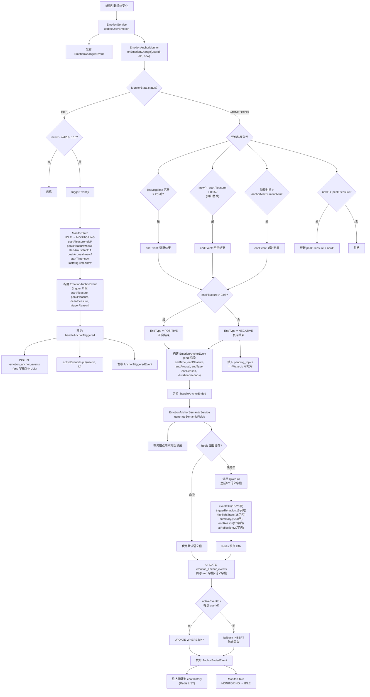
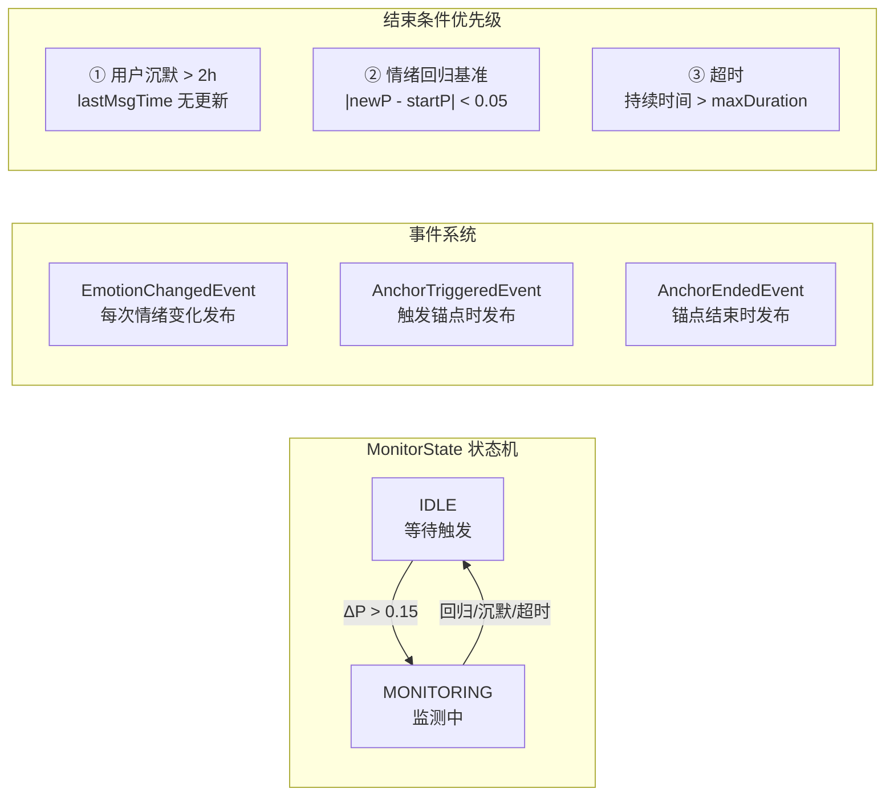

# Anchor 情绪锚点流程图

```mermaid
flowchart TD
    %% ===== 触发阶段 =====
    CHAT[对话引起情绪变化] --> EMOTION["EmotionService<br/>updateUserEmotion"]
    EMOTION --> PUBLISH["发布 EmotionChangedEvent"]
    EMOTION --> MONITOR["EmotionAnchorMonitor<br/>onEmotionChange(userId, old, new)"]

    MONITOR --> STATE{"MonitorState.status?"}

    STATE -->|IDLE| IDLE_CHECK{"|newP - oldP| > 0.15?"}
    IDLE_CHECK -->|否| SKIP[忽略]
    IDLE_CHECK -->|是| TRIGGER["triggerEvent()"]

    STATE -->|MONITORING| MON_EVAL{"评估结束条件"}

    %% ===== 触发详情 =====
    TRIGGER --> MON_STATE["MonitorState<br/>IDLE → MONITORING<br/>startPleasure=oldP<br/>peakPleasure=newP<br/>startArousal=oldA<br/>peakArousal=newA<br/>startTime=now<br/>lastMsgTime=now"]

    MON_STATE --> BUILD_EVT["构建 EmotionAnchorEvent<br/>(trigger 阶段:<br/>startPleasure, peakPleasure,<br/>deltaPleasure, triggerReason)"]

    BUILD_EVT --> ASYNC_TRIG["异步: handleAnchorTriggered"]
    ASYNC_TRIG --> INSERT["INSERT emotion_anchor_events<br/>(end 字段为 NULL)"]
    ASYNC_TRIG --> TRACK["activeEventIds.put(userId, id)"]
    ASYNC_TRIG --> PUB_TRIG["发布 AnchorTriggeredEvent"]

    %% ===== 监测阶段结束判断 =====
    MON_EVAL --> SILENT{"lastMsgTime 沉默<br/>> 2小时?"}
    MON_EVAL --> RETURN{"|newP - startPleasure|<br/>< 0.05?<br/>(回归基准)"}
    MON_EVAL --> TIMEOUT{"持续时间 ><br/>anchorMaxDurationMin?"}
    MON_EVAL --> PEAK{"newP > peakPleasure?"}

    SILENT -->|是| END_EVT["endEvent: 沉默结束"]
    RETURN -->|是| END_EVT2["endEvent: 回归结束"]
    TIMEOUT -->|是| END_EVT3["endEvent: 超时结束"]
    PEAK -->|是| UPDATE_PEAK["更新 peakPleasure = newP"]
    PEAK -->|否| IGNORE2[忽略]

    %% ===== 结束阶段 =====
    END_EVT --> END_TYPE{"endPleasure > 0.05?"}
    END_EVT2 --> END_TYPE
    END_EVT3 --> END_TYPE

    END_TYPE -->|是| POSITIVE["EndType = POSITIVE<br/>正向结束"]
    END_TYPE -->|否| NEGATIVE["EndType = NEGATIVE<br/>负向结束"]

    POSITIVE --> BUILD_END["构建 EmotionAnchorEvent<br/>(end 阶段:<br/>endTime, endPleasure,<br/>endArousal, endType,<br/>endReason, durationSeconds)"]
    NEGATIVE --> BUILD_END

    BUILD_END --> ASYNC_END["异步: handleAnchorEnded"]

    ASYNC_END --> SEMANTIC["EmotionAnchorSemanticService<br/>generateSemanticFields"]

    SEMANTIC --> GET_CHAT["查询锚点期间对话记录"]
    SEMANTIC --> CACHE{"Redis 当日缓存?"}
    CACHE -->|命中| DEFAULTS[使用默认语义值]
    CACHE -->|未命中| AI_CALL["调用 Qwen AI<br/>生成6个语义字段"]
    AI_CALL --> AI_OUTPUT["eventTitle(10-20字)<br/>triggerBehavior(15字内)<br/>highlightTraits(15字内)<br/>summary(≥200字)<br/>endReason(15字内)<br/>aiReflection(20字内)"]

    AI_OUTPUT --> SET_CACHE["Redis 缓存 24h"]

    DEFAULTS --> UPDATE_DB["UPDATE emotion_anchor_events<br/>回写 end 字段+语义字段"]
    SET_CACHE --> UPDATE_DB

    UPDATE_DB --> FIND_ID{"activeEventIds<br/>有该 userId?"}
    FIND_ID -->|有| UPDATE_BY_ID["UPDATE WHERE id=?"]
    FIND_ID -->|无| FALLBACK_INSERT["fallback INSERT<br/>防止丢失"]
    UPDATE_BY_ID --> PUB_END["发布 AnchorEndedEvent"]
    FALLBACK_INSERT --> PUB_END

    PUB_END --> INJECT["注入摘要到 chat:history<br/>(Redis LIST)"]
    PUB_END --> RESET["MonitorState<br/>MONITORING → IDLE"]

    NEGATIVE --> SUSPENSE["插入 pending_topics<br/>=> WakeUp 可取用"]
```

```mermaid
flowchart LR
    subgraph StateMachine[MonitorState 状态机]
        S1["IDLE<br/>等待触发"] -->|"ΔP > 0.15"| S2["MONITORING<br/>监测中"]
        S2 -->|"回归/沉默/超时"| S1
    end

    subgraph Events[事件系统]
        E1["EmotionChangedEvent<br/>每次情绪变化发布"]
        E2["AnchorTriggeredEvent<br/>触发锚点时发布"]
        E3["AnchorEndedEvent<br/>锚点结束时发布"]
    end

    subgraph EndConditions[结束条件优先级]
        C1["① 用户沉默 > 2h<br/>lastMsgTime 无更新"]
        C2["② 情绪回归基准<br/>|newP - startP| < 0.05"]
        C3["③ 超时<br/>持续时间 > maxDuration"]
    end
```
