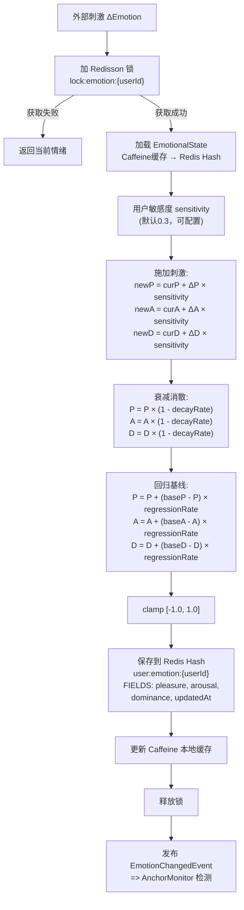
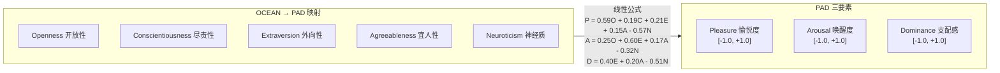
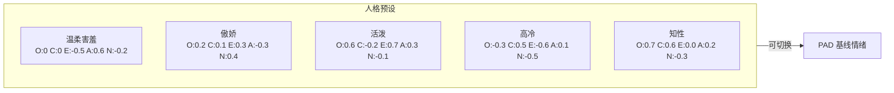
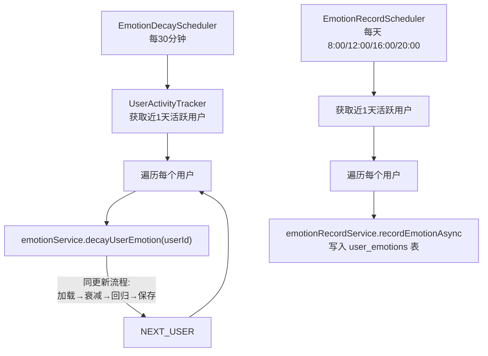
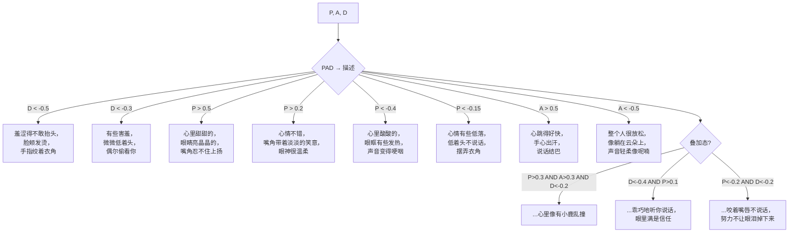
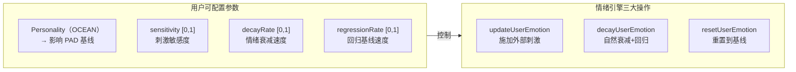

# Emotion 情绪引擎流程图

```mermaid
flowchart TD
    %% ===== 情绪更新 =====
    START[外部刺激 ΔEmotion] --> LOCK["加 Redisson 锁<br/>lock:emotion:{userId}"]
    LOCK -->|获取失败| SKIP_LOCK[返回当前情绪]
    LOCK -->|获取成功| LOAD["加载 EmotionalState<br/>Caffeine缓存 → Redis Hash"]

    LOAD --> SENSITIVITY["用户敏感度 sensitivity<br/>(默认0.3，可配置)"]
    SENSITIVITY --> APPLY["施加刺激:<br/>newP = curP + ΔP × sensitivity<br/>newA = curA + ΔA × sensitivity<br/>newD = curD + ΔD × sensitivity"]

    APPLY --> DECAY["衰减消散:<br/>P = P × (1 - decayRate)<br/>A = A × (1 - decayRate)<br/>D = D × (1 - decayRate)"]

    DECAY --> REGRESS["回归基线:<br/>P = P + (baseP - P) × regressionRate<br/>A = A + (baseA - A) × regressionRate<br/>D = D + (baseD - D) × regressionRate"]

    REGRESS --> CLAMP["clamp [-1.0, 1.0]"]
    CLAMP --> SAVE["保存到 Redis Hash<br/>user:emotion:{userId}<br/>FIELDS: pleasure, arousal,<br/>dominance, updatedAt"]

    SAVE --> CACHE["更新 Caffeine 本地缓存"]
    CACHE --> UNLOCK["释放锁"]
    UNLOCK --> PUB["发布 EmotionChangedEvent<br/>=> AnchorMonitor 检测"]
```

```mermaid
flowchart LR
    subgraph PAD_Core[PAD 三要素]
        P["Pleasure 愉悦度<br/>[-1.0, +1.0]"]
        A["Arousal 唤醒度<br/>[-1.0, +1.0]"]
        D["Dominance 支配感<br/>[-1.0, +1.0]"]
    end

    subgraph OCEAN[OCEAN → PAD 映射]
        O["Openness 开放性"]
        C["Conscientiousness 尽责性"]
        E["Extraversion 外向性"]
        AG["Agreeableness 宜人性"]
        N["Neuroticism 神经质"]
    end

    OCEAN -->|"线性公式<br/>P = 0.59O + 0.19C + 0.21E + 0.15A - 0.57N<br/>A = 0.25O + 0.60E + 0.17A - 0.32N<br/>D = 0.40E + 0.20A - 0.51N"| PAD_Core
```

```mermaid
flowchart LR
    subgraph Personalities[人格预设]
        P1["温柔害羞<br/>O:0 C:0 E:-0.5 A:0.6 N:-0.2"]
        P2["傲娇<br/>O:0.2 C:0.1 E:0.3 A:-0.3 N:0.4"]
        P3["活泼<br/>O:0.6 C:-0.2 E:0.7 A:0.3 N:-0.1"]
        P4["高冷<br/>O:-0.3 C:0.5 E:-0.6 A:0.1 N:-0.5"]
        P5["知性<br/>O:0.7 C:0.6 E:0.0 A:0.2 N:-0.3"]
    end

    Personalities -->|"可切换"| BASE["PAD 基线情绪"]
```

```mermaid
flowchart TD
    %% ===== 衰减调度 =====
    DECAY_SCHED["EmotionDecayScheduler<br/>每30分钟"] --> ACTIVE_USERS["UserActivityTracker<br/>获取近1天活跃用户"]
    ACTIVE_USERS --> LOOP_D["遍历每个用户"]

    LOOP_D --> DECAY_ONE["emotionService.decayUserEmotion(userId)"]
    DECAY_ONE -->|"同更新流程:<br/>加载→衰减→回归→保存"| NEXT_USER
    NEXT_USER --> LOOP_D

    %% ===== 记录调度 =====
    RECORD_SCHED["EmotionRecordScheduler<br/>每天 8:00/12:00/16:00/20:00"] --> ACTIVE_R["获取近1天活跃用户"]
    ACTIVE_R --> LOOP_R["遍历每个用户"]
    LOOP_R --> RECORD["emotionRecordService.recordEmotionAsync<br/>写入 user_emotions 表"]
```

```mermaid
flowchart TD
    %% ===== 心情描述生成 =====
    PAD["P, A, D"] --> MOOD{"PAD → 描述"}
    MOOD -->|D < -0.5| M1["羞涩得不敢抬头，<br/>脸颊发烫，<br/>手指绞着衣角"]
    MOOD -->|D < -0.3| M2["有些害羞，<br/>微微低着头，<br/>偶尔偷看你"]
    MOOD -->|P > 0.5| M3["心里甜甜的，<br/>眼睛亮晶晶的，<br/>嘴角忍不住上扬"]
    MOOD -->|P > 0.2| M4["心情不错，<br/>嘴角带着淡淡的笑意，<br/>眼神很温柔"]
    MOOD -->|P < -0.4| M5["心里酸酸的，<br/>眼眶有些发热，<br/>声音变得哽咽"]
    MOOD -->|P < -0.15| M6["心情有些低落，<br/>低着头不说话，<br/>摆弄衣角"]
    MOOD -->|A > 0.5| M7["心跳得好快，<br/>手心出汗，<br/>说话结巴"]
    MOOD -->|A < -0.5| M8["整个人很放松，<br/>像躺在云朵上，<br/>声音轻柔像呢喃"]

    MOOD --> EXTRA{叠加态?}
    EXTRA -->|"P>0.3 AND A>0.3 AND D<-0.2"| X1["...心里像有小鹿乱撞"]
    EXTRA -->|"D<-0.4 AND P>0.1"| X2["...乖巧地听你说话，<br/>眼里满是信任"]
    EXTRA -->|"P<-0.2 AND D<-0.2"| X3["...咬着嘴唇不说话，<br/>努力不让眼泪掉下来"]
```

```mermaid
flowchart LR
    subgraph Config[用户可配置参数]
        CFG1["Personality（OCEAN）<br/>→ 影响 PAD 基线"]
        CFG2["sensitivity [0,1]<br/>刺激敏感度"]
        CFG3["decayRate [0,1]<br/>情绪衰减速度"]
        CFG4["regressionRate [0,1]<br/>回归基线速度"]
    end

    subgraph ThreeEngines[情绪引擎三大操作]
        OP1["updateUserEmotion<br/>施加外部刺激"]
        OP2["decayUserEmotion<br/>自然衰减+回归"]
        OP3["resetUserEmotion<br/>重置到基线"]
    end

    Config -->|控制| ThreeEngines
```
