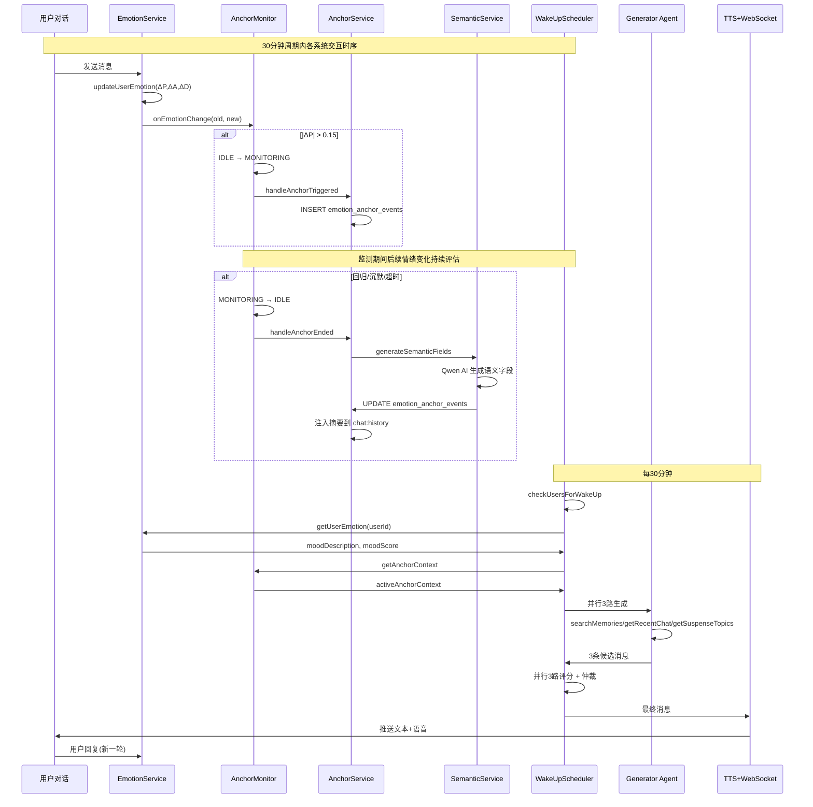
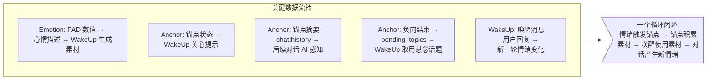

# 三大系统联动流程图

```mermaid
flowchart TD
    subgraph E[Emotion 情绪引擎]
        E1["EmotionService<br/>PAD 计算/衰减/回归"]
        E2["EmotionDecayScheduler<br/>每30分钟衰减"]
        E3["EmotionRecordScheduler<br/>每天4次记录"]
    end

    subgraph A[Anchor 锚点系统]
        A1["EmotionAnchorMonitor<br/>状态机: IDLE↔MONITORING"]
        A2["EmotionAnchorService<br/>触发Insert+结束Update"]
        A3["EmotionAnchorSemanticService<br/>Qwen语义化"]
        A4["pending_topics<br/>悬念池"]
    end

    subgraph W[WakeUp 主动唤醒]
        W1["WakeUpScheduler<br/>每30分钟心跳"]
        W2["Generator ×3<br/>并行生成问候"]
        W3["Scorer ×3<br/>并行评分"]
        W4["Arbiter<br/>仲裁选最优"]
        W5["WakeUpTracker<br/>A/B测试+记录"]
        W6["TTS + WebSocket<br/>语音推送"]
    end

    subgraph DB[(Redis + MySQL)]
        DB1["user:emotion:{userId}<br/>PAD 实时情绪"]
        DB2["emotion_anchor_events<br/>锚点事件持久化"]
        DB3["chat:history:{userId}<br/>对话历史+锚点摘要"]
        DB4["wakeup:record:{userId}:date<br/>唤醒发送记录"]
    end

    %% ---- 核心联动 A ----
    E1 -->|"EmotionChangedEvent"| A1
    A1 -->|"ΔP > 0.15 触发"| A2
    A2 -->|"锚点结束"| A3
    A3 -->|"负向结束"| A4
    A3 -->|"摘要注入"| DB3
    A2 --> DB2

    %% ---- 核心联动 B ----
    A1 -->|"activeAnchorContext"| W["WakeUp<br/>buildAnchorHint"]
    A4 -->|"getSuspenseTopics"| W2
    E1 -->|"moodDescription"| W2
    E1 -->|"moodScore"| W3
    DB3 -->|"对话上下文"| W2

    %% ---- 核心联动 C ----
    W6 -->|"用户回复"| E1["情绪变化"]
    W5 --> DB4

    %% ---- 数据流转 ----
    E1 --> DB1
    DB1 -->|"getUserEmotion"| E1
    DB1 -->|"getUserEmotion"| W

    %% ---- 时间线 ----
    TIMELINE>情绪驱动锚点, 锚点驱动唤醒素材, 唤醒驱动新对话, 新对话驱动情绪变化]
```




