# WakeUp · Anchor · Emotion 三大核心系统流程图

> 项目：langchain4j_sister — AI 妹妹陪伴系统
> 时间：2026-05-27

---

## 一、Emotion — 情绪计算引擎（PAD 模型）

### 1.1 核心数据结构

```
EmotionalState (PAD 三要素)
  ├── pleasure (P) 愉悦度  [-1.0, +1.0]  快感/不悦
  ├── arousal  (A) 唤醒度  [-1.0, +1.0]  兴奋/冷静
  └── dominance(D) 支配感  [-1.0, +1.0]  控制/顺从

Personality (OCEAN 五大人格 → 映射 PAD 基线)
  ├── openness         开放性      → P, A 正相关
  ├── conscientiousness 尽责性      → P 正相关
  ├── extraversion     外向性       → P, A, D 正相关
  ├── agreeableness    宜人性       → P, A, D 正相关
  └── neuroticism      神经质       → P, A, D 负相关

DeltaEmotion (外部刺激 Δ 向量)
  ├── deltaP  愉悦度变化量
  ├── deltaA  唤醒度变化量
  └── deltaD  支配感变化量
```

### 1.2 情绪更新流程图

```mermaid
flowchart TD
    Start([外部事件触发更新]) --> Input[传入 DeltaEmotion ΔP, ΔA, ΔD]
    Input --> Lock{获取 Redisson 分布式锁<br/>lock:emotion:{userId}}
    Lock -->|获取失败| Skip[返回当前缓存情绪]
    Lock -->|获取成功| Load[加载当前 EmotionalState<br/>Caffeine 本地缓存 → Redis Hash]

    Load --> ApplyStimulus["施加刺激:<br/>newP = currentP + ΔP × sensitivity<br/>newA = currentA + ΔA × sensitivity<br/>newD = currentD + ΔD × sensitivity"]

    ApplyStimulus --> DecayRegression["衰减 + 回归基线:<br/>① 衰减: val = val × (1 - decayRate)<br/>② 回归: val = val + (baseVal - val) × regressionRate"]

    DecayRegression --> Save[保存至 Redis Hash<br/>KEY: user:emotion:{userId}<br/>FIELDS: pleasure, arousal, dominance, updatedAt]
    Save --> Cache[更新 Caffeine 本地缓存]
    Cache --> Unlock[释放锁]
    Unlock --> PublishEvent[发布 EmotionChangedEvent]
    PublishEvent --> End([返回新的 EmotionalState copy])
```

### 1.3 情绪衰减调度流程图

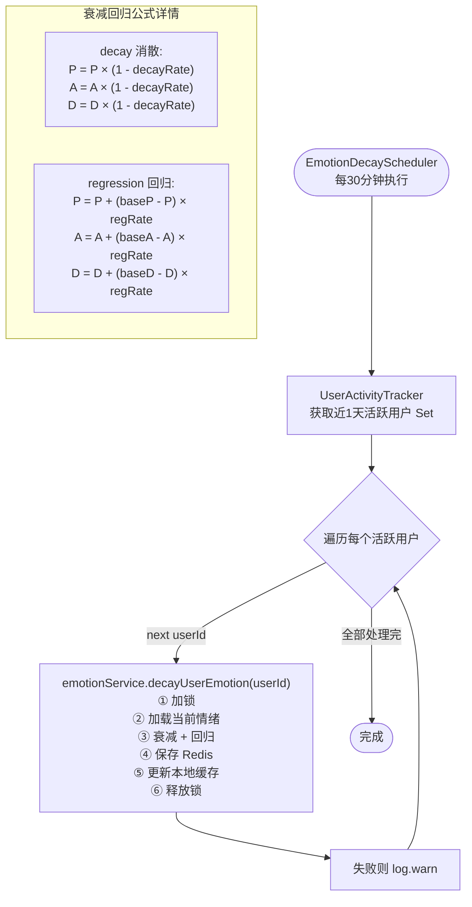

### 1.4 心情描述映射

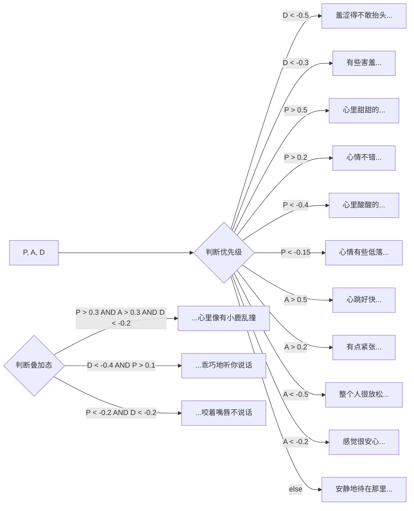

### 1.5 用户个性与参数可配置

```mermaid
flowchart TD
    SetPersonality[SettingsController<br/>设置用户个性] --> Validate{Personality 非空}
    Validate -->|OK| Serialize[序列化 personality JSON]
    Serialize --> RedisSave[保存至 Redis<br/>KEY: user:personality:{userId}<br/>TTL: 30天]
    RedisSave --> InvalidateCache[清除 Caffeine 本地缓存<br/>personalityCache & localCache]
    InvalidateCache --> Recompute[根据 OCEAN→PAD 公式重新计算基线]

    SetConfig[设置情绪引擎参数] --> CheckRange{校验范围<br/>sensitivity [0,1]<br/>decayRate [0,1]<br/>regressionRate [0,1]}
    CheckRange -->|OK| SaveConfig[保存至 Redis<br/>KEY: user:emotion-config:{userId}]
```

---

## 二、Anchor — 情绪锚点系统

### 2.1 锚点生命周期概览

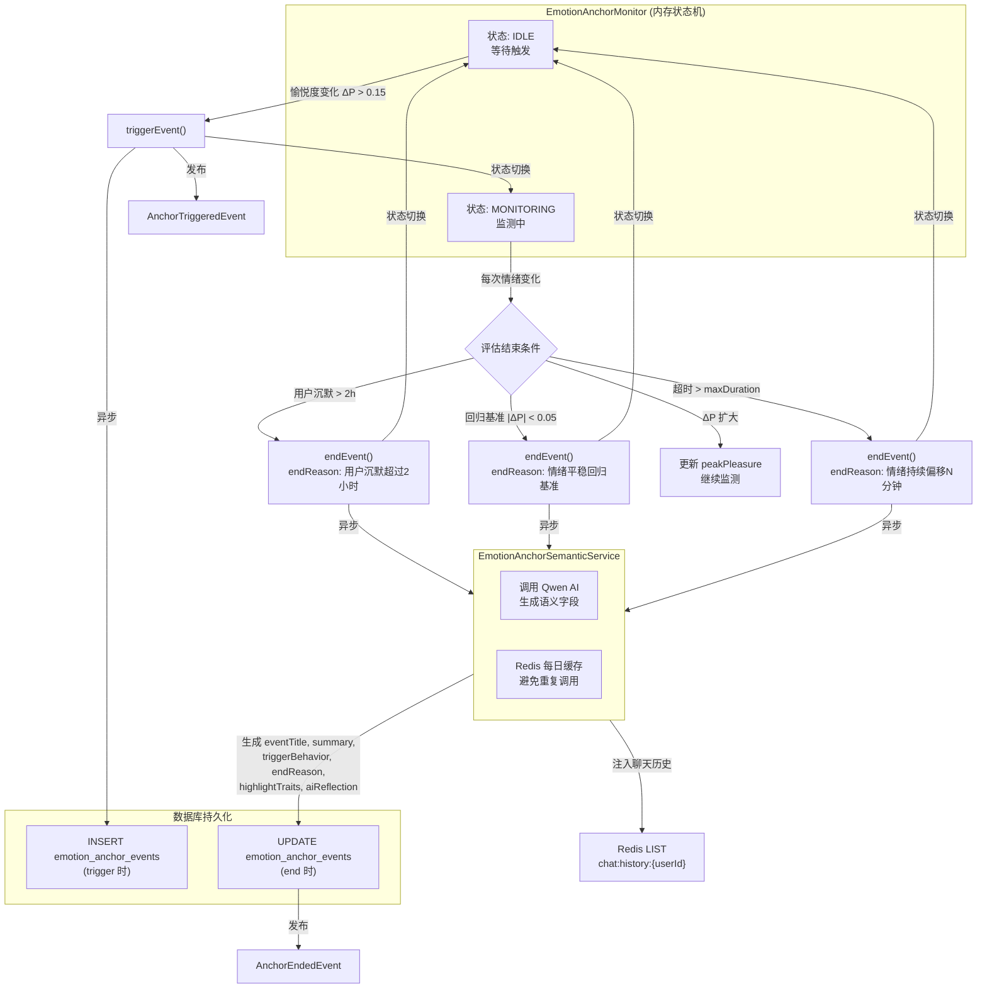

### 2.2 完整锚点触发 → 结束流程图

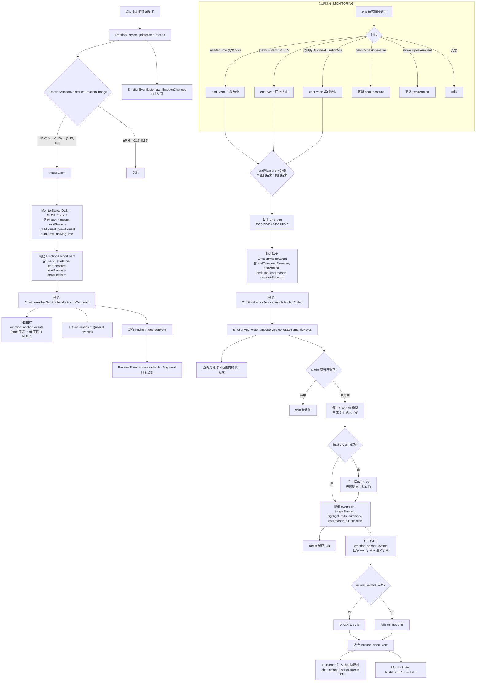

### 2.3 锚点语义化 AI 调用

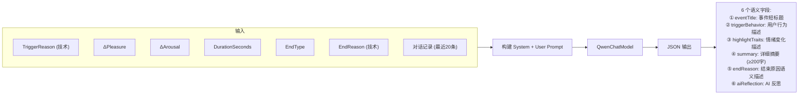

### 2.4 悬念池 (Suspense Topics)

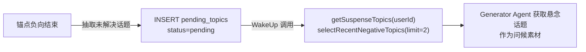

---

## 三、WakeUp — 主动唤醒系统

### 3.1 系统架构总览

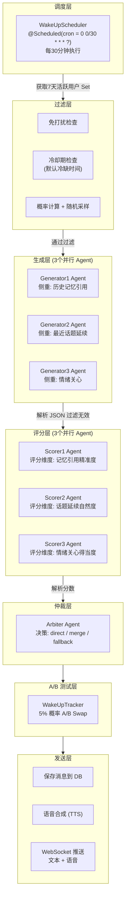

### 3.2 完整唤醒流程（时序细节）

```mermaid
flowchart TD
    %% ===== 触发 =====
    CRON["@Scheduled cron=0 0/30 * * * ?"] --> EnableCheck{"wakeUp.enabled?"}
    EnableCheck -->|false| RETURN1[返回]
    EnableCheck -->|true| ActiveUsers["userActivityTracker<br/>getActiveMemoryIdsInLastDays(7)"]
    ActiveUsers --> EmptyCheck{"活跃用户为空?"}
    EmptyCheck -->|是| RETURN2[返回]
    EmptyCheck -->|否| TIME["TimeContextTool<br/>获取 timeOfDay, specialMoment"]

    TIME --> PER_USER["并行处理每个用户<br/>(虚拟线程)"]

    %% ===== 用户级流程 =====
    PER_USER --> REDIS_LOCK["Redis SET NX EX 600s<br/>KEY: wakeup:processing:{userId}<br/>防止同一用户同时处理"]

    REDIS_LOCK -->|已存在| RETURN3[跳过]
    REDIS_LOCK -->|获取成功| DND_CHECK{"userStateTool<br/>isDoNotDisturb?"}
    DND_CHECK -->|是| RETURN4[跳过, 清理锁]
    DND_CHECK -->|否| COOLDOWN_CHECK{"getMinutesSinceLastWakeup<br/>< cooldownMinutes?"}
    COOLDOWN_CHECK -->|是 (冷却期)| RETURN5[跳过, 清理锁]
    COOLDOWN_CHECK -->|否| CALC_PROB["probability = calculateWakeProbability<br/>基于: silentHours, timeContext,<br/>历史回复率等"]

    CALC_PROB --> RANDOM{"Math.random() > probability?"}
    RANDOM -->|是 (未命中概率)| RETURN6[跳过概率, 清理锁]
    RANDOM -->|否| BUILD_STATE["buildStateSnapshot:<br/>moodDescription, moodScore<br/>silentHours, minutesSinceLastWakeup<br/>activeAnchorContext, recentAnchorSummary"]

    BUILD_STATE --> BUILD_ANCHOR["WakeUpPromptBuilder.buildAnchorHint<br/>拼接 activeAnchorContext + recentAnchorSummary"]

    %% ===== 3 路并行生成 =====
    BUILD_ANCHOR --> G1["Generator1Agent.generate<br/>(虚拟线程) 侧重: 记忆"]
    BUILD_ANCHOR --> G2["Generator2Agent.generate<br/>(虚拟线程) 侧重: 话题"]
    BUILD_ANCHOR --> G3["Generator3Agent.generate<br/>(虚拟线程) 侧重: 情绪"]

    G1 --> PARSE1["contentGenerator.parseGeneratorOutput"]
    G2 --> PARSE2
    G3 --> PARSE3

    PARSE1 --> VALID{"isValidCandidate<br/>(非null/非blank/合规)"}
    PARSE2 --> VALID
    PARSE3 --> VALID

    VALID --> FILTERED["List<GeneratorOutput> candidates<br/>有效保留, 无效置 null"]

    FILTERED --> COUNT_VALID{"有效候选数?"}

    COUNT_VALID -->|0| FALLBACK["Fallback<br/>使用时间问候语: ～今天过得怎么样呀"]
    COUNT_VALID -->|1| SINGLE["直接使用唯一候选"]
    COUNT_VALID -->|≥2| SCORE_PHASE

    FALLBACK --> SEND_FALLBACK["保存消息 + TTS + 推送"]
    SINGLE --> SEND_SINGLE["保存消息 + TTS + 推送"]

    %% ===== 3 路并行评分 =====
    SCORE_PHASE --> SC1["Scorer1Agent.score<br/>维度: 记忆引用精准自然 0-10"]
    SCORE_PHASE --> SC2["Scorer2Agent.score<br/>维度: 话题延续自然 0-10"]
    SCORE_PHASE --> SC3["Scorer3Agent.score<br/>维度: 情绪关心得当 0-10"]

    SC1 --> P_SC1["WakeUpScorer.parseScoreResult"]
    SC2 --> P_SC2
    SC3 --> P_SC3

    P_SC1 --> ARB_INPUT["WakeUpScoreResult<br/>(score + reason)"]
    P_SC2 --> ARB_INPUT
    P_SC3 --> ARB_INPUT

    %% ===== 仲裁 =====
    ARB_INPUT --> ARBITER["WakeUpArbiterAgent.decide"]
    ARBITER --> ARB_PARSE["WakeUpArbiter.parseArbiterResult"]

    ARB_PARSE --> ARB_DECIDE{"decision 类型?"}

    ARB_DECIDE -->|direct| BEST_IDX["selectedIndex → 最佳候选"]
    ARB_DECIDE -->|merge| MERGE["mergedMessage 作为融合消息"]
    ARB_DECIDE -->|fallback| FALLBACK2["fallback 问候"]

    BEST_IDX --> AB_TEST["WakeUpTracker.maybeSwap<br/>5% 概率 A/B 测试<br/>用次优替换最优"]
    MERGE --> AB_TEST

    AB_TEST --> SELECT_OUTPUT["contentGenerator.selectOutput<br/>按仲裁索引选取 finalOutput"]
    SELECT_OUTPUT --> GET_VOICE["获取 VoiceSynthesisParam<br/>(音量/语速/音高/情感指令)"]

    %% ===== 发送 =====
    GET_VOICE --> SAVE_MSG["converMessageService.saveMessage<br/>保存到 MySQL"]
    SAVE_MSG --> TTS_STEP{"voiceSynthesisService.synthesize"}

    TTS_STEP -->|成功| PUSH_AUDIO["chatPushService.pushText(文本)<br/>chatPushService.pushAudio(音频)"]
    TTS_STEP -->|失败| PUSH_FALLBACK["chatPushService.pushText(纯文本)"]

    PUSH_AUDIO --> RECORD["WakeUpTracker.recordSent<br/>存入 Redis List<br/>KEY: wakeup:record:{userId}:yyyyMMdd"]
    PUSH_FALLBACK --> RECORD

    RECORD --> CLEAN_LOCK["Redis DEL processingKey<br/>释放处理锁"]
    CLEAN_LOCK --> END_USER([用户处理完成])
```

### 3.3 Generator Agent Prompt 策略

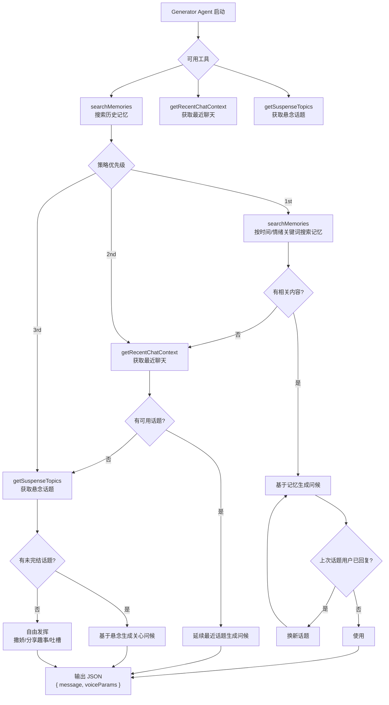

### 3.4 Scorer Agent 评分维度

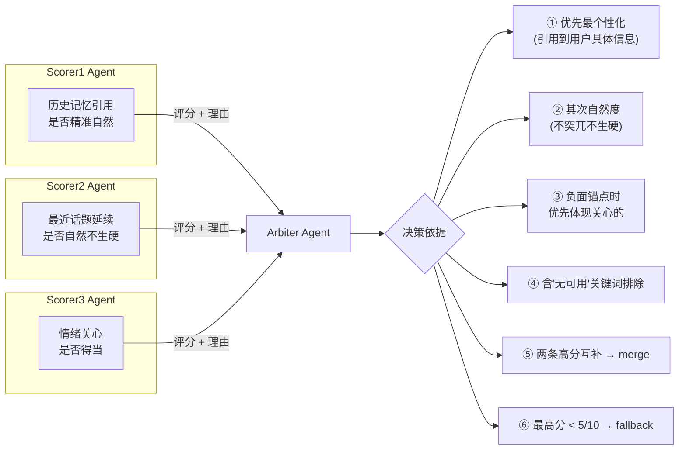

### 3.5 A/B 测试机制

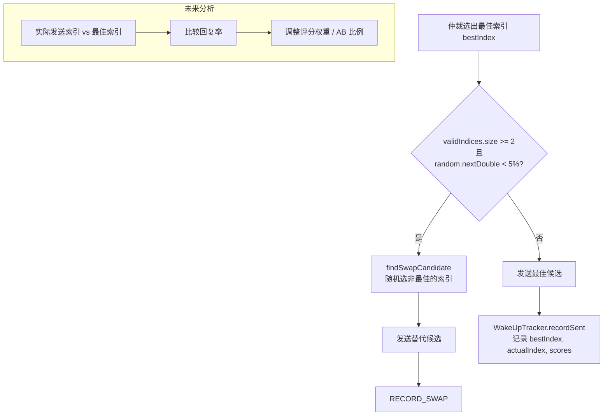

### 3.6 用户回复追踪

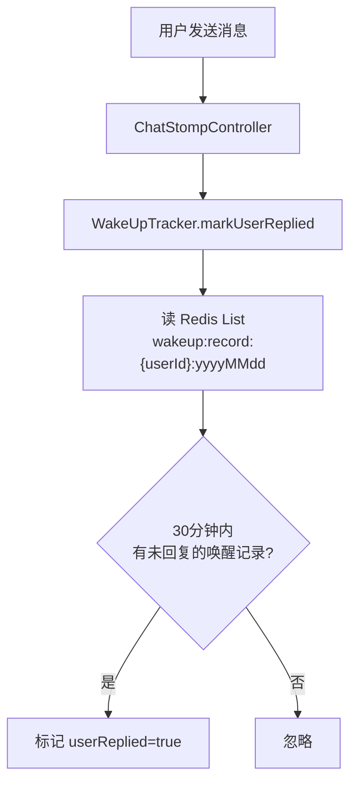

---

## 四、三大系统联动关系

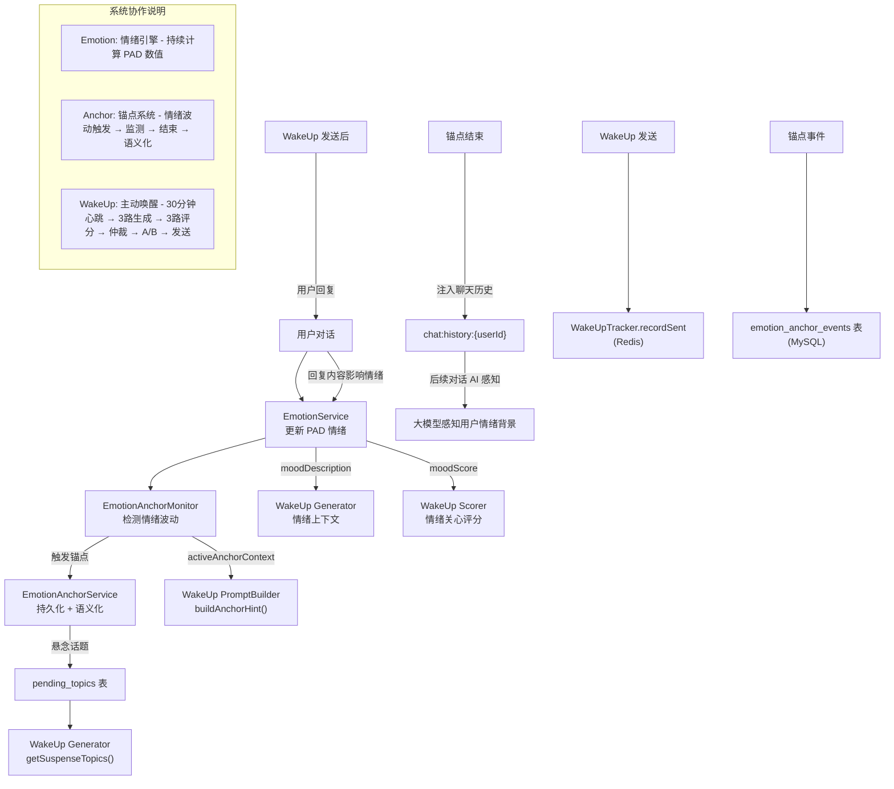

---

## 五、数据流汇总

### 5.1 核心 Redis Key 一览

| Key 模式 | 类型 | 用途 | TTL |
|---|---|---|---|
| `user:emotion:{userId}` | Hash | PAD 情绪状态 | 7天 |
| `user:personality:{userId}` | String | OCEAN 人格 | 30天 |
| `user:emotion-config:{userId}` | String | 情绪引擎参数 | 30天 |
| `wakeup:processing:{userId}` | String | 处理锁（防止并行） | 600s |
| `wakeup:record:{userId}:yyyyMMdd` | String | 唤醒发送记录列表 | 永久 |
| `lock:emotion:{userId}` | Redisson Lock | 情绪更新分布式锁 | - |
| `chat:history:{userId}` | List | 聊天历史（含锚点摘要） | 永久 |
| `anchor:summary:{userId}:yyyy-MM-dd` | String | AI 语义化每日缓存 | 24h |

### 5.2 核心 MySQL 表一览

| 表名 | 用途 |
|---|---|
| `emotion_anchor_events` | 锚点事件（含 trigger + end + 语义字段） |
| `user_emotions` | 历史情绪记录快照 |
| `pending_topics` | 未解决话题（悬念池） |
| `conver_messages` | 聊天记录 |
| `conversation_memories` | 日记化记忆 |
