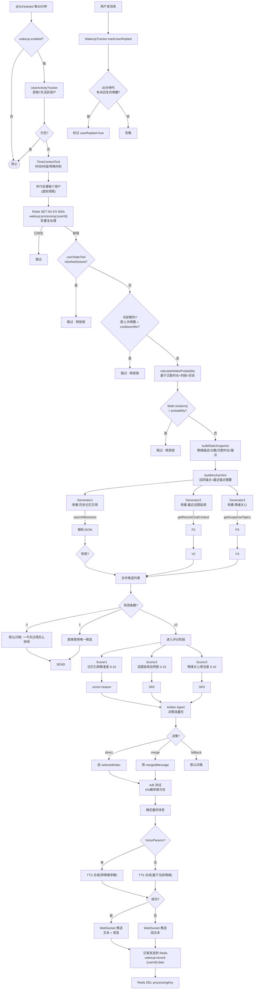
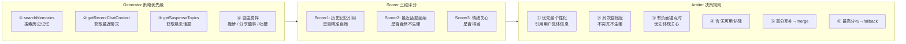

# WakeUp 主动唤醒流程图

```mermaid
flowchart TD
    %% ===== 触发 & 过滤 =====
    CRON["@Scheduled 每30分钟"] --> ENABLE{"wakeup.enabled?"}
    ENABLE -->|否| STOP([停止])
    ENABLE -->|是| USERS["UserActivityTracker<br/>获取7天活跃用户"]
    USERS --> EMPTY{"为空?"}
    EMPTY -->|是| STOP
    EMPTY -->|否| TIME["TimeContextTool<br/>时间/时段/特殊时刻"]

    TIME --> PARALLEL["并行处理每个用户<br/>(虚拟线程)"]

    PARALLEL --> LOCK["Redis SET NX EX 600s<br/>wakeup:processing:{userId}<br/>防重复处理"]
    LOCK -->|已存在| SKIP_LOCK[跳过]
    LOCK -->|新锁| DND{"userStateTool<br/>isDoNotDisturb?"}
    DND -->|是| SKIP_DND[跳过 · 释放锁]
    DND -->|否| COOLDOWN{"冷却期内?<br/>距上次唤醒 < cooldownMin?"}
    COOLDOWN -->|是| SKIP_COOL[跳过 · 释放锁]
    COOLDOWN -->|否| PROB["calculateWakeProbability<br/>基于沉默时长+时段+历史"]

    PROB --> ROLL{"Math.random()<br/>> probability?"}
    ROLL -->|是| SKIP_PROB[跳过 · 释放锁]
    ROLL -->|否| SNAPSHOT["buildStateSnapshot<br/>情绪描述/分数/沉默时长/锚点"]

    %% ===== 3路并行生成 =====
    SNAPSHOT --> ANCHOR_HINT["buildAnchorHint<br/>活跃锚点+最近锚点摘要"]
    ANCHOR_HINT --> G1["Generator1<br/>侧重:历史记忆引用"]
    ANCHOR_HINT --> G2["Generator2<br/>侧重:最近话题延续"]
    ANCHOR_HINT --> G3["Generator3<br/>侧重:情绪关心"]

    G1 -->|searchMemories| P1[解析JSON]
    G2 -->|getRecentChatContext| P2
    G3 -->|getSuspenseTopics| P3

    P1 --> V1{"有效?"}
    P2 --> V2
    P3 --> V3
    V1 --> CAND[合并候选列表]
    V2 --> CAND
    V3 --> CAND

    CAND --> COUNT{"有效条数?"}

    COUNT -->|0| FALLBACK["默认问候: ～今天过得怎么样呀"]
    COUNT -->|1| SINGLE["直接使用唯一候选"]
    COUNT -->|≥2| SCORE[进入评分阶段]

    FALLBACK --> SEND
    SINGLE --> SEND

    %% ===== 3路并行评分 =====
    SCORE --> SC1["Scorer1<br/>记忆引用精准度 0-10"]
    SCORE --> SC2["Scorer2<br/>话题延续自然度 0-10"]
    SCORE --> SC3["Scorer3<br/>情绪关心得当度 0-10"]

    SC1 --> SR1[score+reason]
    SC2 --> SR2
    SC3 --> SR3

    SR1 --> ARB["Arbiter Agent<br/>决策选最优"]
    SR2 --> ARB
    SR3 --> ARB

    ARB --> DECIDE{"决策?"}
    DECIDE -->|direct| PICK[选 selectedIndex]
    DECIDE -->|merge| MERGE[用 mergedMessage]
    DECIDE -->|fallback| FALLBACK2[默认问候]

    PICK --> AB["A/B 测试<br/>5%概率换次优"]
    MERGE --> AB

    AB --> MSG[确定最终消息]

    %% ===== 发送 =====
    MSG --> VOICE{"VoiceParams?"}
    VOICE -->|有| TTS1["TTS 合成(带情感参数)"]
    VOICE -->|无| TTS2["TTS 合成(基于当前情绪)"]
    TTS1 --> OK{"成功?"}
    TTS2 --> OK
    OK -->|是| PUSH["WebSocket 推送<br/>文本 + 语音"]
    OK -->|否| PUSH_TEXT["WebSocket 推送<br/>纯文本"]
    PUSH --> RECORD["记录发送到 Redis<br/>wakeup:record:{userId}:date"]
    PUSH_TEXT --> RECORD
    RECORD --> CLEAN["Redis DEL processingKey"]

    %% ===== 用户回复追踪 =====
    REPLY[用户发消息] --> WAKE["WakeUpTracker.markUserReplied"]
    WAKE --> FIND{"30分钟内<br/>有未回复的唤醒?"}
    FIND -->|是| MARK[标记 userReplied=true]
    FIND -->|否| IGNORE[忽略]
```

```mermaid
flowchart LR
    subgraph Generator[Generator 策略优先级]
        G1_S["① searchMemories<br/>搜索历史记忆"]
        G2_S["② getRecentChatContext<br/>获取最近聊天"]
        G3_S["③ getSuspenseTopics<br/>获取悬念话题"]
        G4_S["④ 自由发挥<br/>撒娇 / 分享趣事 / 吐槽"]
    end

    subgraph Scorer[Scorer 三维评分]
        S1_D["Scorer1: 历史记忆引用<br/>是否精准自然"]
        S2_D["Scorer2: 最近话题延续<br/>是否自然不生硬"]
        S3_D["Scorer3: 情绪关心<br/>是否得当"]
    end

    subgraph Arbiter[Arbiter 决策规则]
        A1["① 优先最个性化<br/>引用用户具体信息"]
        A2["② 其次自然度<br/>不突兀不生硬"]
        A3["③ 有负面锚点时<br/>优先体现关心"]
        A4["④ 含'无可用'排除"]
        A5["⑤ 高分互补→merge"]
        A6["⑥ 最高分<5→fallback"]
    end

    Generator --> Scorer --> Arbiter
```
